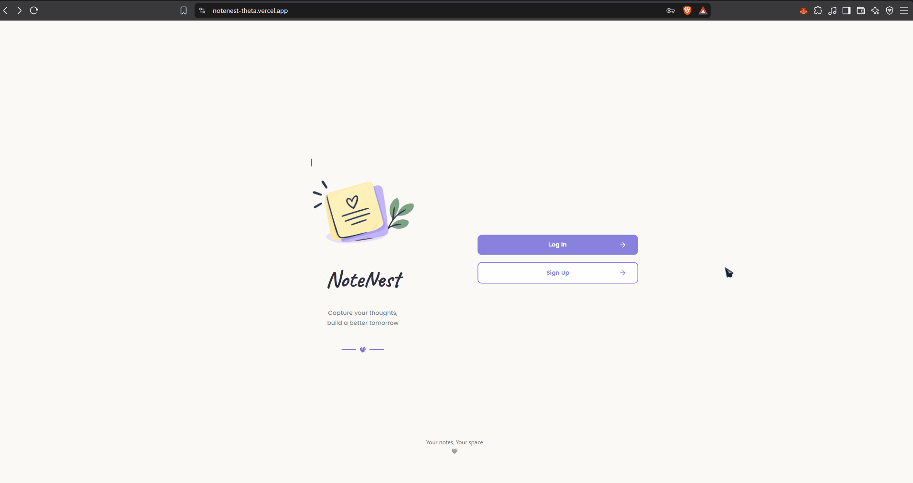
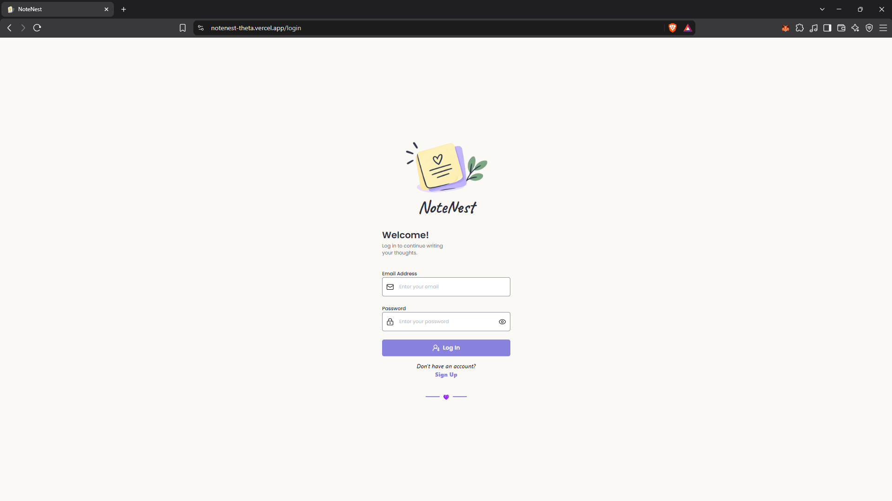
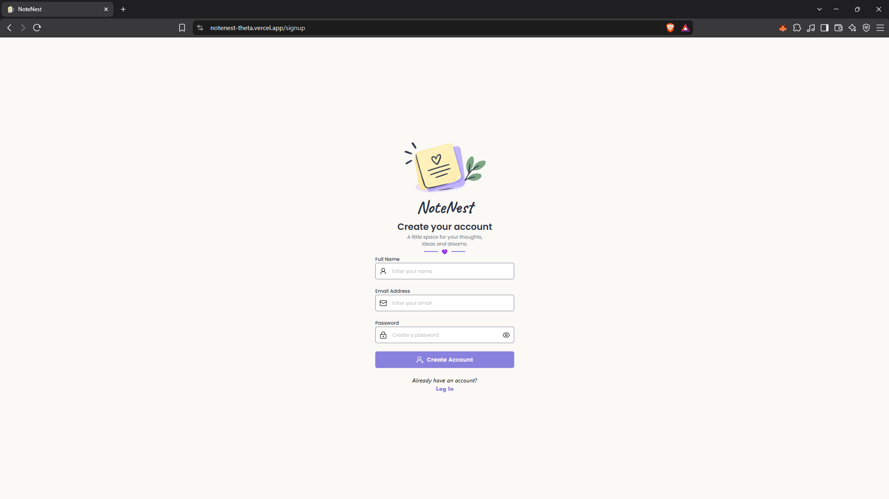
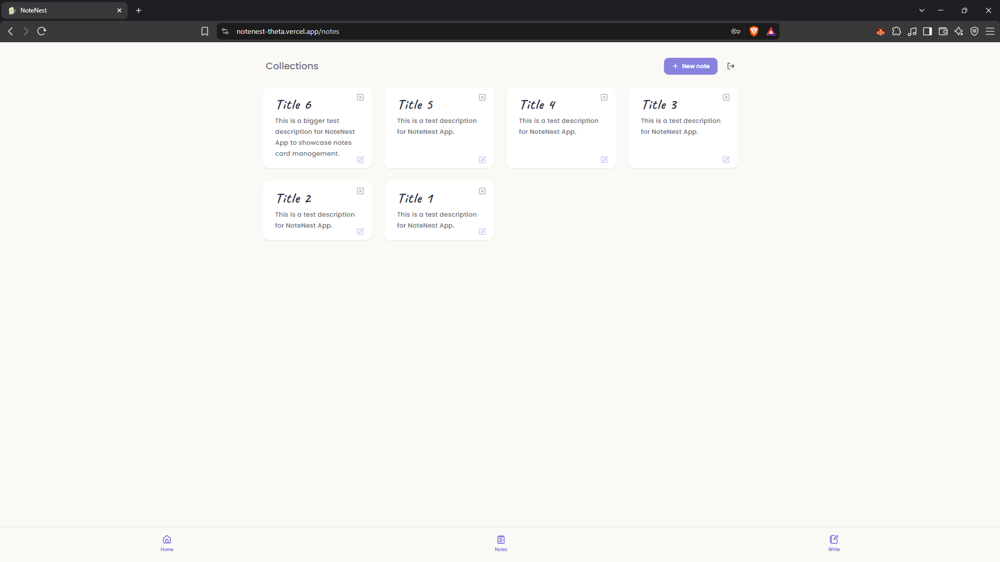
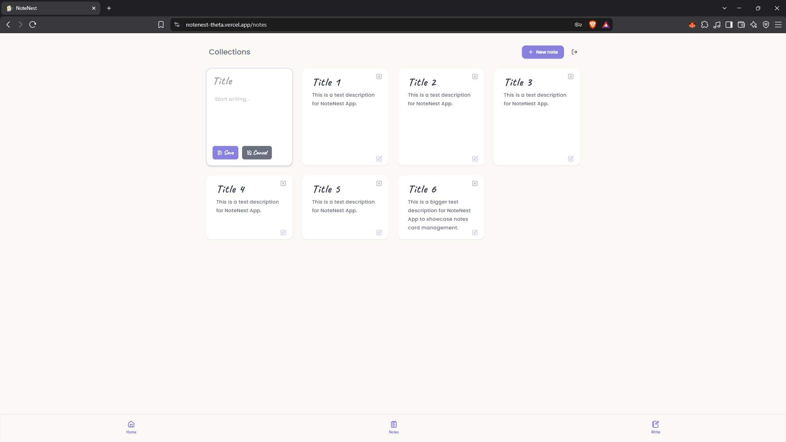

<h1 align="start">
  <span style="display: inline-flex; align-items: center; gap: 8px;">
    
    NoteNest
  </span>
</h1>


A full-stack note-taking application built with the MERN stack.

**Live Demo:** https://notenest-theta.vercel.app

**Backend API:** https://notenest-20v2.onrender.com

---

## Overview

NoteNest allows authenticated users to create, view, edit, and delete their own notes through a responsive web interface.

---

## Features

* User registration and login
* JWT-based authentication
* Protected frontend routes
* Protected backend API routes
* User-specific notes
* Create, read, update, and delete notes
* Password hashing with bcrypt
* Input validation
* Responsive UI
* Centralized Axios API configuration
* User logout

---

## Screenshots

### Work Flow



### Home Page


### Authentication





### Dashboard



### Session Management



---

## Tech Stack

### Frontend

* React
* React Router
* Axios
* Tailwind CSS
* Lucide React

### Backend

* Node.js
* Express.js
* MongoDB
* Mongoose
* JSON Web Tokens (JWT)
* bcrypt

---

## Authentication

NoteNest uses JWT-based authentication.

When a user successfully logs in, the backend generates a JWT containing the user's ID. The frontend stores the token and sends it with protected API requests using the `Authorization` header:

```text
Authorization: Bearer <token>
```

The backend authentication middleware verifies the token before allowing access to protected note routes.

Each note is associated with its owner, and note operations are restricted to the authenticated user.

---

## API

### Authentication

| Method | Endpoint           | Description         |
| ------ | ------------------ | ------------------- |
| POST   | `/api/auth/signup` | Register a new user |
| POST   | `/api/auth/login`  | Authenticate a user |

### Notes

All note endpoints require authentication.

| Method | Endpoint         | Description          |
| ------ | ---------------- | -------------------- |
| GET    | `/api/notes`     | Get the user's notes |
| POST   | `/api/notes`     | Create a note        |
| PATCH  | `/api/notes/:id` | Update a note        |
| DELETE | `/api/notes/:id` | Delete a note        |

### Health Check

```text
GET /api/health
```

Returns the current server status.

---

## Project Structure

```text
NoteNest/
│
├── frontend/
│   └── src/
│       ├── api/
│       ├── components/
│       ├── context/
│       ├── pages/
│       ├── App.jsx
│       └── main.jsx
│
├── backend/
│   ├── src/
│   │   ├── controllers/
│   │   ├── db/
│   │   ├── middlewares/
│   │   ├── models/
│   │   └── routes/
│   ├── server.js
│   └── package.json
│
├── screenshots/
├── .gitignore
├── .node-version
└── README.md
```

---

## Getting Started

### Prerequisites

* Node.js
* MongoDB
* Git

### Clone the repository

```bash
git clone https://github.com/skybreakerW/NoteNest.git
cd NoteNest
```

### Backend setup

```bash
cd backend
npm install
```

Create a `.env` file inside the `backend` directory:

```env
PORT=3000
DB_URI=your_mongodb_connection_string
JWT_SECRET=your_jwt_secret
```

Start the backend:

```bash
npm run dev
```

### Frontend setup

Open another terminal:

```bash
cd frontend
npm install
npm run dev
```

The frontend will then be available through the local Vite development server.

---

## Environment Variables

The backend requires:

| Variable     | Description                         |
| ------------ | ----------------------------------- |
| `PORT`       | Port used by the Express server     |
| `DB_URI`     | MongoDB connection string           |
| `JWT_SECRET` | Secret used to sign and verify JWTs |

**Never commit your `.env` file or expose your JWT secret.**

---

## Current Status

NoteNest is a deployed full-stack portfolio project demonstrating authentication, authorization, CRUD operations, and production deployment using the MERN stack.

The current version includes:

* JWT authentication
* Protected routes
* User-specific note ownership
* Full note CRUD functionality
* Responsive frontend interface
* Login, signup, and logout flows

---

## Future Improvements

* Automated frontend/backend testing
* Note search and filtering
* Note categories or tags

---

## License

This project is currently intended as a portfolio and learning project.
